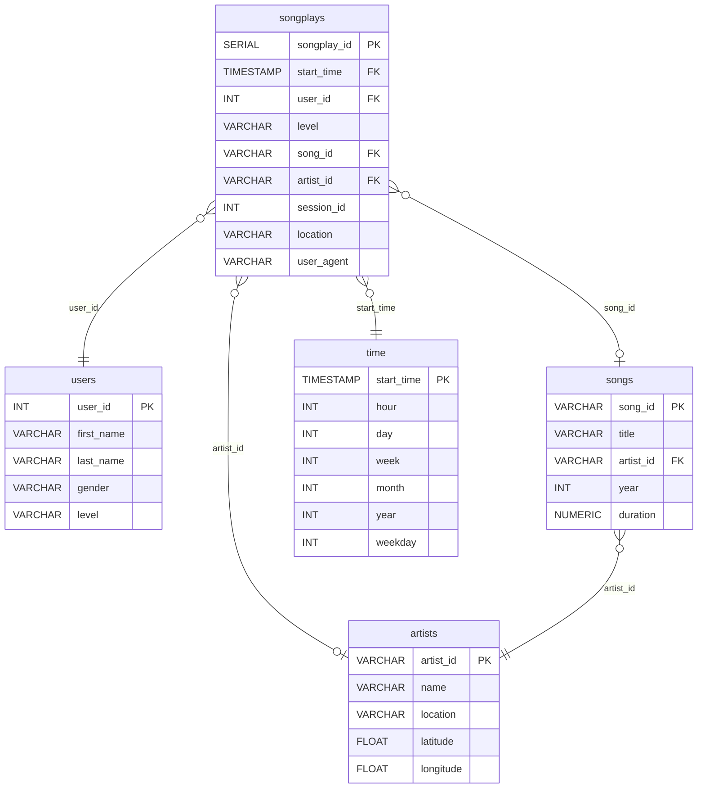

# Sparkify Postgres ETL | Star Schema Data Modeling

An ETL pipeline that extracts user activity and song metadata from JSON logs, transforms it into a dimensional model, and loads it into a PostgreSQL star schema built for analytical querying.

**Stack:** Python · PostgreSQL · psycopg2 · pandas

---

## Overview

Sparkify, a music streaming startup, collects listening activity as JSON files. In that form the data cannot be queried or joined, which makes analysis impractical. This project builds the pipeline that turns those files into a relational database the analytics team can use.

The target design is a star schema: one fact table recording song plays, surrounded by four dimension tables holding descriptive context. This keeps analytical queries simple, since a question like "which hours see the most paid-tier listening" requires one join rather than several.

## Schema



`songplays` is the fact table. Each row is one play event, holding the measurable activity and foreign keys out to the dimensions. The dimension tables are denormalized on purpose, trading some redundancy for query simplicity, which is the right call for an analytical workload.

## Design Decisions

- **Users are upserted, not inserted.** A listener can move between free and paid tiers, so a plain insert would either fail on the primary key or keep a stale subscription level.

```sql
INSERT INTO users (user_id, first_name, last_name, gender, level)
VALUES (%s, %s, %s, %s, %s)
ON CONFLICT (user_id) DO UPDATE
SET first_name = EXCLUDED.first_name,
    last_name  = EXCLUDED.last_name,
    gender     = EXCLUDED.gender,
    level      = EXCLUDED.level
```

- **Other tables use `ON CONFLICT DO NOTHING`.** Song, artist, and time records are immutable once written, so re-running the pipeline over the same files is safe and does not duplicate rows.

- **Song and artist IDs on the fact table are nullable.** Matching a play event to the catalog requires an exact match on title, artist name, and duration, and the catalog subset does not contain every song in the logs. Unmatched plays are recorded with null identifiers rather than dropped, which preserves the event and makes the coverage gap measurable.

- **Timestamps are decomposed into a time dimension at load.** Hour-of-day and day-of-week analysis then requires no date functions at query time.

## Pipeline

| Stage | Script | What it does |
|---|---|---|
| Schema setup | `create_tables.py` | Drops and recreates the database and all five tables |
| Song ingest | `etl.py` → `process_song_file` | Reads song JSON, populates `songs` and `artists` |
| Log ingest | `etl.py` → `process_log_file` | Filters to `NextSong` events, decomposes timestamps, populates `time`, `users`, `songplays` |
| Verification | `test.ipynb` | Confirms tables are populated and constraints hold |

`etl.ipynb` is the development notebook where the transformation logic was worked out one file at a time before being generalized into `etl.py`.

## Setup and Usage

Requires a running PostgreSQL instance and Python 3.

```bash
git clone https://github.com/AliKatMcKin/sparkify-postgres-etl.git
cd sparkify-postgres-etl
pip install pandas psycopg2-binary

python create_tables.py   # build the schema
python etl.py             # run the pipeline
```

Then open `test.ipynb` to verify the load.

## Repository Structure

```
├── create_tables.py   # Database and table creation
├── etl.py             # ETL pipeline
├── sql_queries.py     # All DDL and DML statements
├── etl.ipynb          # Development notebook
├── test.ipynb         # Load verification
└── data/
    ├── song_data/     # Song metadata JSON
    └── log_data/      # User activity log JSON
```

## Limitations

- Connection parameters are hardcoded to local development defaults. In production these belong in environment variables.
- Inserts are row-by-row, which is readable and correct at this volume. At scale, `execute_batch` or `COPY` would be substantially faster.
- Song matching is exact-match on three fields, so `song_id` and `artist_id` coverage on the fact table is limited by the size of the catalog subset.
- The activity logs are simulated rather than real user data.

## Attribution

Project scenario, starter structure, and sample data were provided as part of the Udacity/WGU Data Wrangling curriculum. The schema design, SQL statements, transformation logic, and pipeline implementation are my own work.

*Completed for D497 Data Wrangling, BS in Data Analytics, Western Governors University. Author: Alissa McKinney.*
